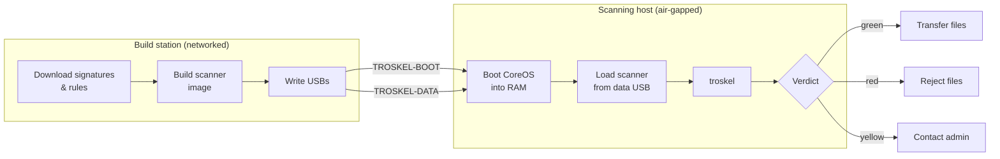
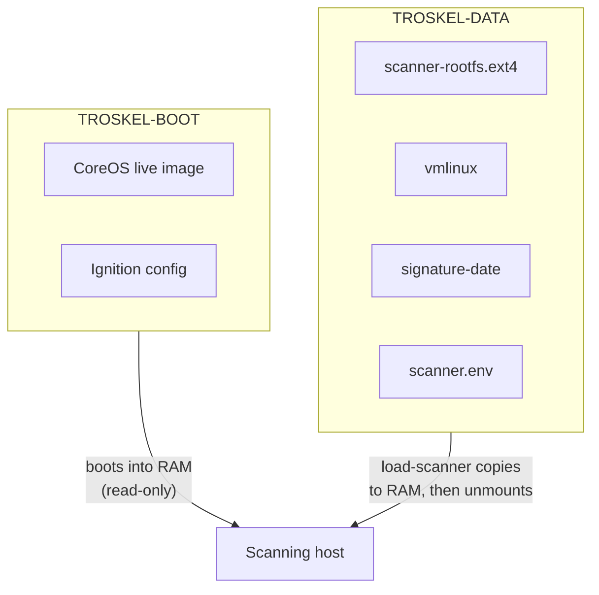
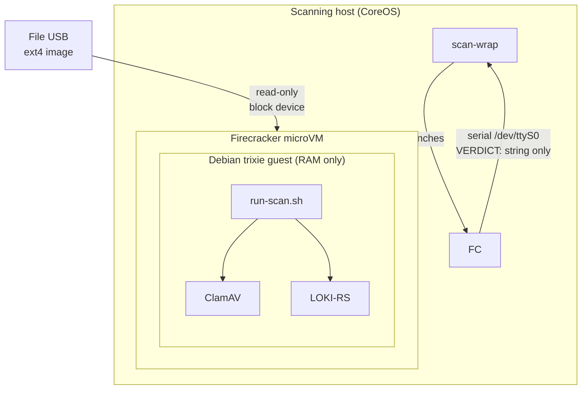
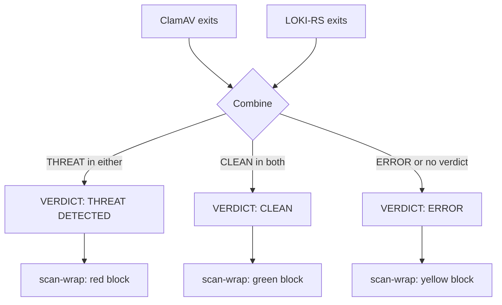

# Architecture

## System overview

Troskel splits into two physically separate machines connected only by USB sticks. The boundary between them is the air gap.

---

## Why two machines

Signature freshness needs internet. Air-gapped operation forbids it. The split enforces this cleanly: the build station pulls and the scanning host consumes. The two machines never touch the same network.

---

## Why two USB sticks

The split enforces a clean access pattern. `load-scanner` reads the data USB once at boot, copies everything to RAM, and unmounts it. The data USB is never touched again during the session. There is no persistent writable storage on the scanning host.

---

## Why CoreOS

Four properties are required: boot from removable media into RAM, apply a declarative configuration on every boot, leave no persistent state, small attack surface. CoreOS satisfies all four. The configuration is compiled from `config/scanner-host.bu` using Butane and embedded into the boot ISO.

---

## Why Firecracker

Both ClamAV and LOKI-RS have parser surfaces that should be assumed exploitable. Running them inside a Firecracker microVM means that exploiting a parser vulnerability gets the attacker inside the guest, not on the scanning host.

The serial channel is one-way text. The guest can only emit characters. A compromised guest cannot write to the host filesystem, open network connections, or influence the host beyond the verdict string it emits.

---

## Verdict pipeline

The logic is fail-closed. Anything other than an explicit `VERDICT: CLEAN` in both engine paths produces yellow or red. An empty log, a guest kernel panic, an OOM kill, or garbage output all produce yellow.

---

## Configuration

Two files govern all tunables:

| File                  | Purpose                                                         | Used by                                                  |
|-----------------------|-----------------------------------------------------------------|----------------------------------------------------------|
| `config/versions.env` | Upstream component versions and recorded SHA-256s               | Build station scripts only                               |
| `config/scanner.env`  | Operational policy (freshness thresholds, VM sizing, file caps) | Build station + propagated to scanning host via data USB |

`scanner.env` travels to the scanning host on the data USB and is copied to `/var/lib/troskel/scanner.env` by `load-scanner` at boot. `check-system-ready` and `scan-wrap` source it at runtime. Admins adjust policy by editing `scanner.env` and running `troskel-build.sh --update` to write a fresh data USB.

`versions.env` is build-station-only. It carries pinned versions for software components (Firecracker, Butane, LOKI-RS, kernel, wordlist) alongside their recorded SHA-256s, and pinned tags for detection inputs that publish them (LOKI IOC base). Every artefact the build station downloads is integrity-verified against the values recorded here; see `SECURITY.md` for the verification taxonomy.

---

## Why Debian trixie inside the guest

Bookworm was the initial candidate but ships glibc 2.36, which is below the 2.39+ floor required by LOKI-RS v2.10.0. Trixie satisfies that constraint. This choice should be re-evaluated once trixie reaches stable, as the minbase package set may shift slightly.

---

## What is not defended against

- **Novel malware with no signature.** Green means no engine matched any known signature — not guaranteed clean.
- **BadUSB / HID injection.** A malicious USB presenting as a keyboard could type commands. Physical control of the scanning room and operator training are the mitigations.
- **Supply-chain compromise at the source.** Software components are integrity-verified at download, which catches transit-level tampering and CDN corruption. An attacker who controls a signing key, or who can substitute artefacts on a CDN that publishes its own sidecars, defeats the verification at the source. No client-side mechanism can detect that.

See [`docs/SECURITY.md`](SECURITY.md) for the full threat model and residual risk register.